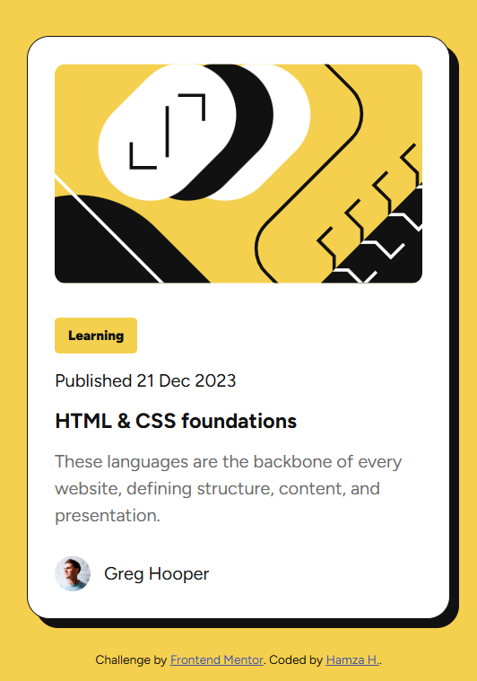
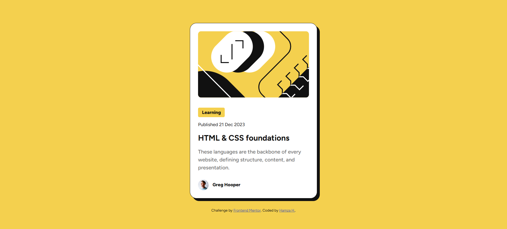
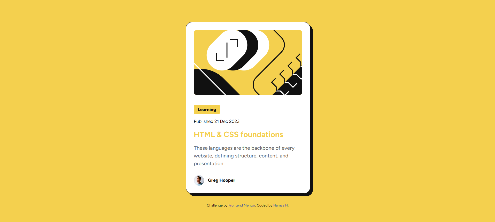

# Frontend Mentor - Blog Preview Card Solution

This is a solution to the [Blog preview card challenge on Frontend Mentor](https://www.frontendmentor.io/challenges/blog-preview-card-ckPaj01IcS). Frontend Mentor challenges help you improve your coding skills by building realistic projects.

## Table of Contents

- [Overview](#overview)
  - [The Challenge](#the-challenge)
  - [Screenshot](#screenshot)
  - [Links](#links)
- [Built With](#built-with)
- [What I Learned](#what-i-learned)
- [Useful Resources](#useful-resources)
- [Author](#author)

## Overview

### The Challenge

Users should be able to:

- See hover and focus states for all interactive elements on the page

### Screenshot





### Links

- [Solution URL](https://github.com/hhamza1/blog-preview-card)
- [Live Site URL](https://hhamza1.github.io/blog-preview-card/)

## Built With

- Semantic HTML5 markup
- CSS custom properties
- Flexbox
- Mobile-first workflow
- Google Fonts ([Figtree](https://fonts.google.com/specimen/Figtree))

## What I Learned

This project helped me improve my understanding of structured UI design and mobile-first responsiveness. Below are some highlights:

```css
.card {
    display: flex;
    flex-direction: column;
    border: 1px solid #111;
    background-color: #fff;
    box-shadow: 8px 8px 0px #111;
    border-radius: 20px;
    padding: 24px;
}
```

```html
<div class="card">
  <div class="blog-img-container">
    
  </div>
  <div class="article-info">
    <div class="tag text-preset-3-bold">Learning</div>
    <div class="date text-preset-3">Published 21 Dec 2023</div>
    <h3 class="text-preset-1">HTML & CSS foundations</h3>
    <p class="text-preset-2">These languages are the backbone of every website, defining structure, content, and presentation.</p>
  </div>
</div>
```

## Useful Resources

- [CSS Tricks - Flexbox Guide](https://css-tricks.com/snippets/css/a-guide-to-flexbox/)
- [MDN Web Docs - CSS Grid](https://developer.mozilla.org/en-US/docs/Web/CSS/CSS_Grid_Layout)

## Author

- GitHub - [hhamza1](https://github.com/hhamza1)
- Frontend Mentor - [@hhamza1](https://www.frontendmentor.io/profile/hhamza1)

Let's build and learn together! 🚀
